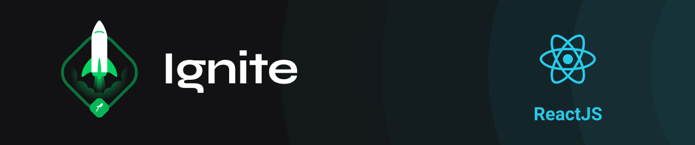

<h3 align="center">
  Challenge: Worldtrip
</h3>

  
  
  
  

  <a href="#rocket-about-the-challenge">About the Challenge</a>&nbsp;&nbsp;&nbsp;|&nbsp;&nbsp;&nbsp;
  <a href="#technologies">Technologies</a>&nbsp;&nbsp;&nbsp;|&nbsp;&nbsp;&nbsp;
  <a href="#installation">Installation</a>&nbsp;&nbsp;&nbsp;|&nbsp;&nbsp;&nbsp;
  <a href="#memo-license">License</a>

 

---

## :rocket: About the Challenge

The challenge is to put into practice the use of the Chakra UI.

## Technologies

- [Next.js](https://nextjs.org/)
- [Chakra UI](https://chakra-ui.com/)
- [Typescript](https://www.typescriptlang.org/)
- [Swiperjs](https://swiperjs.com/)

## Installation

1. Clone the repository: `git@github.com:matheus-neves/ignite-worldtrip.git`
2. Access the directory: `cd ignite-worldtrip`
3. Install the dependencies: `yarn`
4. Run the app: `yarn dev`

## :memo: License

This challenge is under license from MIT. See the archive [LICENSE](https://github.com/matheus-neves/ignite-worldtrip/blob/main/LICENSE) for more details.

---

Challenge completed :heavy_check_mark:

Made with 💜 by Matheus Neves [See my linkedin!](https://www.linkedin.com/in/matheus-neves-front-end/) :wave:
